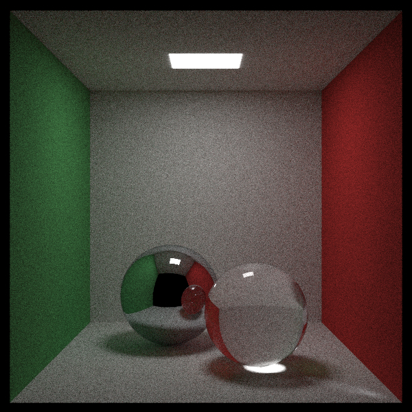

# raytracer

This is a C++ implementation of a basic raytracer. It follows pretty directly from Peter Shirley's [Ray Tracing in One Weekend](https://raytracing.github.io/).

This repo also contains notes on raytracers (and some general topics in computer graphics) that I took while working on the program.

